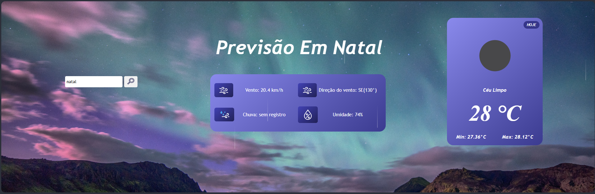

# Previsão do tempo 🌤️

---

## Sobre

O ClimaFácil nasceu com o objetivo de oferecer uma previsão do tempo prática, rápida e confiável para o seu dia a dia. Desenvolvido com integração à API da OpenWeather, o app entrega informações em tempo real sobre temperatura, sensação térmica, umidade, vento, previsão de chuva, entre outros dados essenciais.

Seja para planejar um passeio, saber como se vestir, ou até mesmo para quem depende do clima para o trabalho, aqui você encontra tudo o que precisa com interface simples, responsiva e intuitiva.

---

## Tecnologias

 
  

---

## Imagens

---

## 🤝 **Agradecimentos e Contribuições**

**Quero agradecer a uma das maiores escolas do Brasil para Desenvolvedore(a) que é o DevClub**

**E também muito obrigado a todos que fazem o DevClub pela contruibuiçoes**
